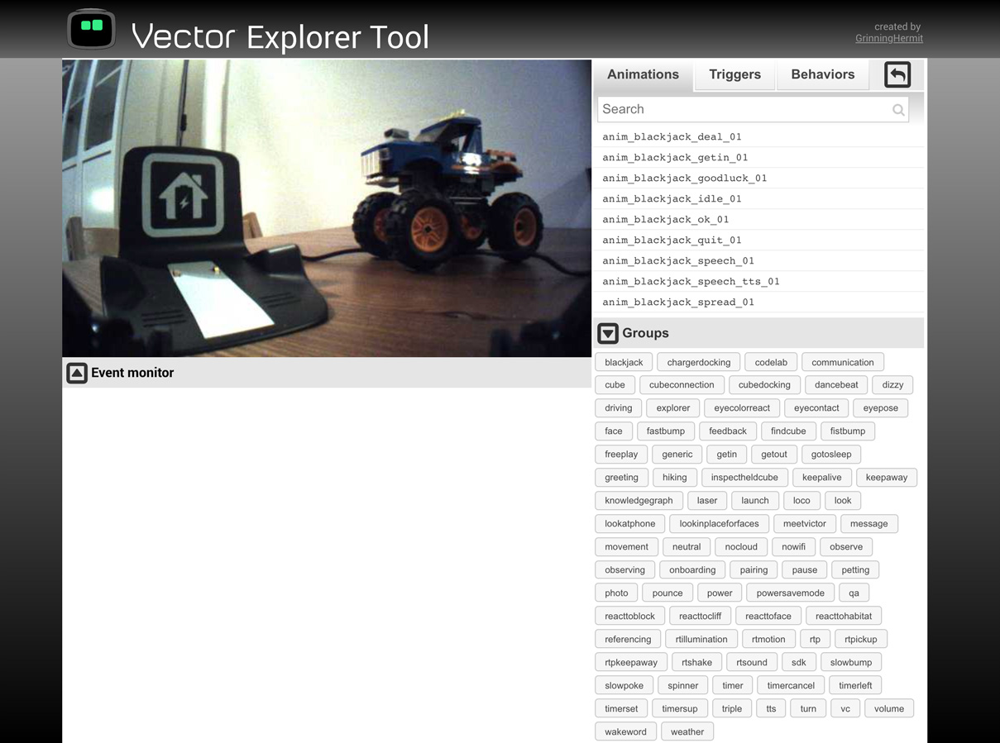

# Vector-Explorer-Tool
Interface exposing functionality of the robot Vector from Anki
---
This tool gives control over Vector. You can look through his camera while using keyboard buttons or a game controller to control him. It also lists and plays all built-in animations. 

This is a conversion of the Cozmo Explorer Tool (https://github.com/GrinningHermit/Cozmo-Explorer-Tool) for the newer Anki robot Vector. In its current state it is still very basic and not all functionalities from the Cozmo variant are copied (event monitor, triggers and behaviors are not included). This version is aimed at the alpha release of the Vector SDK and it may change completely over time.

What does it do exactly?
-
Running the script 'explorer_tool.py' in python will open a web page. It is divided in 3 sections:

1. ROBOT CAMERA AND CONTROL: A constant camera feed is visible. While mousing over this area, controls for Vector are also visible, indicating how to control Vector with the keyboard or game controller. It's also possible to make the feed full screen. The game controller left stick controls movement, the right stick controls the head and arm.

2. ANIMATIONS: A user can click the play button of a listed animation and Vector will execute it. It is also possible to search for a particular animation and buttons are provided to group animations based on their naming convention. 

What do you need to use it?
-
1. Vector himself (http://anki.com/vector)
2. A computer
3. A little knowledge about Python
4. Knowledge of the Vector SDK (https://developer.anki.com/vector/docs)
5. The files in this repository
6. The python module Pillow. (pip3 install --user Pillow, usually already installed when working with the Cozmo SDK)
7. The python module Flask. (pip3 install --user flask)

If you know how to run an example file from the Vector SDK, you should be able to run this script. 

System requirements
-
- Computer with Windows OS, mac OSX or Linux
- Python 3.6.1 or later
- WiFi connection
- (optional) Game controller detectable with HTML5 browsers

Installation notes
-
- Running 'vector-explorer-tool.py' will attempt to open a browser window at 127.0.0.1:5000. This is similar to  'remote_control.py' from the Vector SDK examples.
- Game controller compatibility can be tested at http://html5gamepad.com/ (tested with Xbox 360 usb controller)

Compatibility
-
- Vector SDK 0.5.1 (alpha)

Known issues
-
- Event monitor, triggers and behaviors (features of the Cozmo explorer tool) are disabled due to needed research time and SDK differences compared to the Cozmo SDK.
- IR light is something Vector does not have and needs to be removed in a future release. 
- Free play button needs to be fixed.
- The python module flask-socket-io currently has no function without the event monitor
